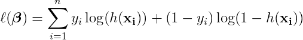
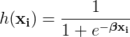
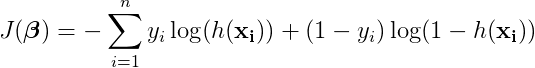
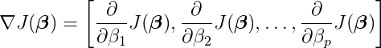
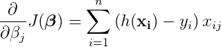

# Gradient-Descent-Implementation

## 1: Cost function and Gradient

In order to be able to evaluate if our gradient descent algorithm is working
correctly, we will need to be able to calculate the cost.

Recall the log likelihood function for logistic regression. Our goal is to *maximize* this value.

<!--
\ell(\boldsymbol\beta) = \sum_{i=1}^{n} y_i \log ( h(\mathbf{x_i}) ) + (1-y_i) \log (1 - h(\mathbf{x_i}))
-->

Recall that the hypothesis function *h* is defined as follows:

<!--
h(\mathbf{x_i}) = \frac{1}{1+e^{-\boldsymbol\beta\mathbf{x_i}}}
-->

Since we will be implemented Gradient *Descent*, which *minimizes* a function, we'll look at the cost function below, which is just the negation of the log likelihood function above.

<!--
J(\boldsymbol\beta) = - \sum_{i=1}^{n} y_i \log ( h(\mathbf{x_i}) ) + (1-y_i) \log (1 - h(\mathbf{x_i}))
-->

The gradient of the cost function is as follows:

<!--
\nabla J(\boldsymbol\beta) =
\left[
\frac\partial{\partial\beta_1}J(\boldsymbol\beta),
\frac\partial{\partial\beta_2}J(\boldsymbol\beta),
\ldots,
\frac\partial{\partial\beta_p}J(\boldsymbol\beta)
\right]
-->

Each partial derivative will be computed as follows:

<!--
\frac\partial{\partial\beta_j}J(\boldsymbol\beta) =
\sum_{i=1}^n \left( h(\mathbf{x_i}) - y_i \right ) x_{ij}
-->

## Code
`logistic_regression_functions.py`

Implemented  `predict_proba` , `predict`, `cost` and `gradient` functions.

`predict_proba`: calculates the result of `h(x)` for the given coefficients.

`predict`: Rounds the proba values so that we get a prediction of either 0 or 1. An optional argument is provided for the threshold, which is defaulted to `0.5`.  **Note:** The names of these functions were chosen to align with `sklearn`'s conventions.

`cost_batch`: Uses `predict_proba` function to calculate cost using the current parameters and the whole
data set. The function also included a regularization term for Ridge if necessary.

`gradient_batch` : Uses `predict_proba` function to calculate gradient of the cost function using the current parameters and the whole data set.

`cost_SGD`: Calculates cost using an random individual data point.

`gradient_SGD`: Calculates gradient of the cost function using an random individual data point.

## 2: Gradient Descent

In this pseudocode, and in the implementation default setting, gradient descent will stop after a given number of iterations. Another more common approach is also provided as an option `step_size` to stop once the incremental improvement in the optimization function is sufficiently small.

    Gradient Descent:
        input: J: differential function (optimization function)
               α: learning rate
               k: number of iterations
        output: local maximum of optimization function J

        initialize β (often as all 0's)
        repeat for k iterations:
            β <- β - α * gradient(J)

## code
`GradientDescent.py`.

Implemented `GradientDescent` class and `__init__`, `fit`, `fit_SGD`, `predict`, `add_intercept` method.

`__init__`: Initialize the class instance with a number of options, most importance ones being: cost function choice and gradient function choice

`fit`: Follows the pseudocode from above, using the selected cost and gradient function passed from `logistic_regression_functions.py` to iterate gradient steps. The function uses the whole data set.

`fit_SGD`: The individual data point version of fit.

`predict`: Calling the predict function from `logistic_regression_functions.py` to make final prediction.

`add_intercept`: If selected True when initializing the `GradientDescent` instance, a ones columns will be added to the training data and testing data
